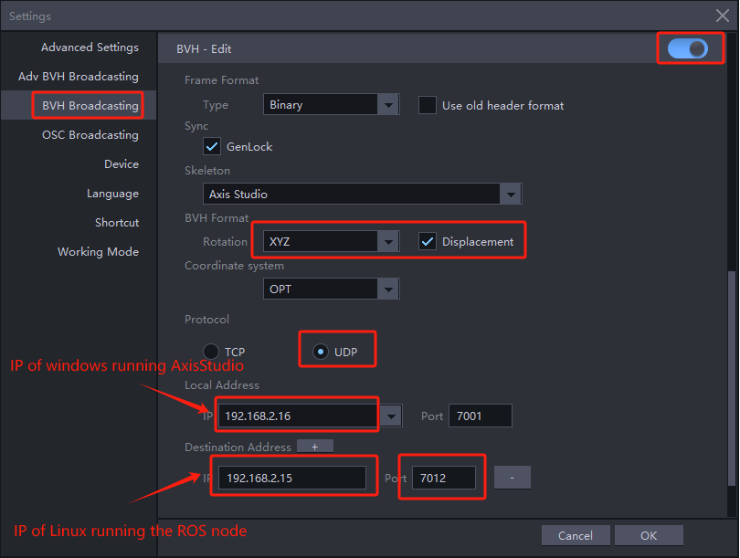

# Description

This repo contains code to:
1. Retarget the upper body of any BVH file onto a Unitree G1 29dof robot with Inspire hands
2. Similarly retarget online BVH data from a Noitom costume (Axis Studio app required)
3. Send retargeted angles to the real robot

# Dependencies

### PC on Linux and Windows

You need 2 computers: a Windows PC to run Axis Studio and a Linux PC (Ubuntu 22.04 recommended) to run this whole repo. Running both on one PC with a virtual system should be possible, though it has not been tested.

### Conda

Pinocchio must be installed through conda to include the casadi optimization module

https://www.anaconda.com/docs/getting-started/miniconda/install/linux-install

Then create a conda venv with Python 3.10

### Python libs

Install libraries from requirements.py through conda install -c conda_forge

### Unitree sdk2

Unitree_sdk2_py is required to run retargeting on the real robot:

https://github.com/unitreerobotics/unitree_sdk2_python

### Ros2

Follow the guide to install:

https://docs.ros.org/en/humble/Installation.html

### Visualization

You can visualize retargeting in Rviz, check out this repo:

https://github.com/pnmocap/mocap_ros_urdf

### Axis Studio

Set up the correct parameters in Axis Studio settings to broadcast BVH (BVH - Edit to broadcast data from edit mode, BVH - Capturing to broadcast the current state of the costume)



### Interface setup

When connected to the robot, run ```ip a```

Find the name of the interface through which you are connected to the robot,
and insert it in the ```IFNAME``` constant in ```scripts\teleop_ros2.py```.


# How to launch

- ```scripts/retarget_online_hands.py```
Runs a program that receives data from Axis Studio, performs retargeting, and publishes joint angles (both hands and the waist yaw joint) in the ros2 ```/joint_states``` topic. Hand retargeting is also performed, and hand_states are published via the ```/hand_state/r``` and ```/hand_state/r``` topics.

- You can visualize joint_states on the robot in Rviz using this repo:

    https://github.com/pnmocap/mocap_ros_urdf


- ```scripts/teleop_ros2.py```
Subscribes to the mentioned topics and leverages unitree_sdk2_py (unitree_g1/unitree_g1 UnitreeG1 class) to control the robot.
When the program is launched, the robot slowly (5s) transitions into your current state and starts to mimic your actions. When Ctrl+C is pressed,
it similarly transitions back to idle.

    A wired connection to the robot is necessary to run this. Make sure that all IP configuration is done according to the official guide:

    https://support.unitree.com/home/en/developer/Quick_start, Network configuration